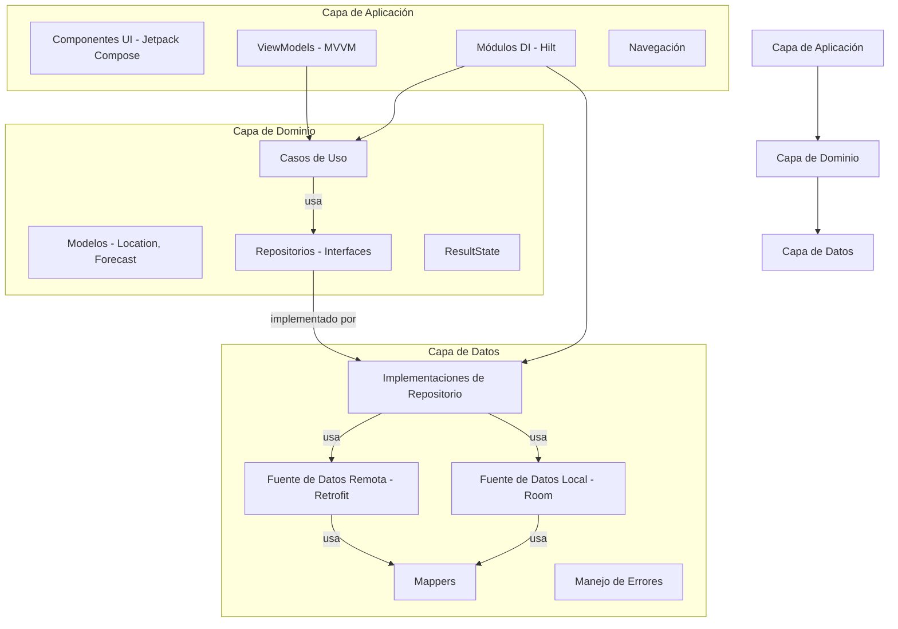

# 📱 Bold Challenge - Aplicación de Pronóstico del Tiempo

---
## 🧭 Resumen del Proyecto

Este proyecto es una implementación completa de una **Aplicación Android de Pronóstico del Tiempo** utilizando **Kotlin**, **Jetpack Compose** y principios de **Arquitectura Limpia**.

### 🔍 Características Principales

- **Búsqueda de Ubicaciones**: Búsqueda de ubicaciones en tiempo real con entrada con debounce (retraso de 500ms) para optimizar llamadas a la API
- **Pronóstico del Tiempo**: Pronóstico del tiempo de 3 días con información detallada por día
- **Estrategia Cache-First**: 
  - Visualización inmediata de datos en caché cuando están disponibles
  - Actualización en segundo plano desde la red
  - Experiencia offline sin interrupciones
- **UI Moderna**: Diseño Material 3 con animaciones fluidas y diseños responsivos
- **Gestión de Estado**: Manejo explícito de estados con `ResultState` (Loading, Success, Failure)

### 🎯 Decisiones y Suposiciones Clave

- **Arquitectura Limpia**: Separación estricta en capas domain/data/app
- **Fuentes de Datos Duales**: API online (WeatherAPI.com) + base de datos Room offline con gestión automática de caché
- **Enfoque Cache-First**: Siempre mostrar datos en caché inmediatamente, actualizar en segundo plano
- **Patrón MVVM**: ViewModels por pantalla para clara separación de responsabilidades
- **Basado en Flow**: Flujo de datos reactivo usando Kotlin Coroutines Flow
- **Diseño Offline-First**: Base de datos Room para persistencia local de datos
- **Búsqueda con Debounce**: Debounce de 500ms para reducir llamadas innecesarias a la API
- **Manejo de Errores**: Manejo elegante de errores con mensajes amigables y funcionalidad de reintento

---
## Enfoque de Arquitectura

La aplicación se adhiere estrictamente a los principios de **Arquitectura Limpia**, dividiendo el código en tres módulos distintos:

* **Capa de Dominio**: Este módulo contiene la lógica de negocio central, incluyendo modelos (p. ej., `Location`, `Forecast`, `ForecastDay`), interfaces de repositorio (`LocationRepository`, `ForecastRepository`), casos de uso (p. ej., `SearchLocationsUseCase`, `GetForecastUseCase`), y la clase sellada `ResultState` para gestión de estado. Es independiente de frameworks específicos de Android.
* **Capa de Datos**: Esta capa es responsable de implementar las interfaces de repositorio definidas en la capa de dominio. Incluye fuentes de datos remotas (Retrofit para llamadas API a WeatherAPI.com), fuentes de datos locales (Base de datos Room para caché), mappers para convertir DTOs a modelos de dominio, y manejo de errores.
* **Capa de Aplicación**: Esta es la capa de presentación, que contiene componentes de UI (Composables de Jetpack Compose), ViewModels para gestión de estado (patrón MVVM), navegación usando Navigation Compose, y módulos de DI Hilt para inyección de dependencias.



---
## 📱 Pantallas

### 1. Pantalla de Inicio (Splash)
- Pantalla de inicio animada simple
- Navegación automática a la pantalla de Búsqueda después de un breve retraso
- Componente UI puro (no necesita ViewModel)

### 2. Pantalla de Búsqueda
- **Barra de Búsqueda**: Búsqueda de ubicaciones en tiempo real con debounce (500ms)
- **Lista de Resultados**: Muestra ubicaciones coincidentes
- **Gestión de Estado**:
  - Estado de carga con datos en caché opcionales
  - Estado vacío cuando no se encuentran resultados
  - Estado de error con funcionalidad de reintento
  - Estado de éxito con lista de ubicaciones
- **Navegación**: Toca una ubicación para navegar al Detalle del Pronóstico

### 3. Pantalla de Detalle del Pronóstico
- **Nombre de Ubicación**: Muestra la ubicación seleccionada
- **Pronóstico de 3 Días**: Información del tiempo para los próximos 3 días
- **Detalles del Tiempo**: 
  - Fecha
  - Temperatura promedio (°C)
  - Texto de condición
  - Icono de condición
- **Gestión de Estado**:
  - Carga con datos en caché (si están disponibles)
  - Indicador de actualización cuando se refresca
  - Estado de error con reintento
  - Estado de éxito con datos del pronóstico
- **Cache-First**: Muestra datos en caché inmediatamente, actualiza en segundo plano

---
## 🔄 Flujo de Datos

### Flujo de Búsqueda
1. El usuario escribe en la barra de búsqueda
2. El ViewModel aplica debounce a la entrada (500ms)
3. El Caso de Uso valida la consulta (mínimo 2 caracteres)
4. El Repositorio verifica la caché primero
5. Emite `Loading` con datos en caché (si están disponibles)
6. Obtiene datos de la API en segundo plano
7. Actualiza la caché y emite `Success` con datos frescos
8. En caso de error, muestra datos en caché o mensaje de error

### Flujo de Pronóstico
1. El usuario selecciona una ubicación
2. El ViewModel recibe el nombre de la ubicación de la navegación
3. El Caso de Uso obtiene el pronóstico
4. El Repositorio verifica la caché primero
5. Emite `Loading` con pronóstico en caché (si está disponible)
6. Obtiene datos de la API en segundo plano
7. Actualiza la caché y emite `Success` con pronóstico fresco
8. En caso de error, muestra pronóstico en caché o mensaje de error

---
## 🛠️ Stack Tecnológico

### Tecnologías Core
- **Kotlin** 2.2.0
- **Jetpack Compose** (Material 3)
- **Android Gradle Plugin** 8.11.1
- **Min SDK** 21
- **Target SDK** 36

### Arquitectura y Patrones
- **Arquitectura Limpia** (capas Domain, Data, App)
- **MVVM** (Model-View-ViewModel)
- **Patrón Repositorio**
- **Casos de Uso** (Lógica de Negocio)

### Librerías
- **Inyección de Dependencias**: Hilt 2.57.2
- **Red**: Retrofit 3.0.0, OkHttp 4.12.0
- **Serialización JSON**: Moshi 1.15.0
- **Base de Datos**: Room 2.7.1
- **Corrutinas**: Kotlinx Coroutines 1.10.2
- **Navegación**: Navigation Compose
- **Carga de Imágenes**: Coil 2.7.0
- **Testing**: JUnit 5, MockK, Turbine, Espresso

---
## ✅ Estrategia de Testing

### Tipos de Pruebas

- **Pruebas Unitarias** para casos de uso, ViewModels, repositorios, fuentes de datos y mappers
- **Pruebas UI Instrumentadas** para flujos de usuario clave
- **Pruebas de Flow** usando Turbine para streams reactivos

### Framework de Testing

- **JUnit 5** (Framework de testing moderno)
- **MockK** para mockear dependencias
- **Turbine** para testing de Flow
- **Espresso** para testing de UI
- **Hilt Testing** para inyección de dependencias en pruebas

### Cobertura de Pruebas

Las pruebas están organizadas por capa:
- `domain/test`: Pruebas de casos de uso
- `data/test`: Pruebas de repositorios y fuentes de datos
- `app/test`: Pruebas de ViewModels
- `app/androidTest`: Pruebas de UI e integración

---
## 🔐 Cómo Ejecutar

### Prerrequisitos

- Android Studio Hedgehog o posterior
- JDK 17 o posterior
- Android SDK con nivel de API 21+
- Clave API de WeatherAPI.com

### Pasos de Configuración

1. **Clonar el repositorio**
   ```bash
   git clone <url-del-repositorio>
   cd boldchallenge
   ```

2. **Configurar Clave API**
   - Crear o editar `local.properties` en el directorio raíz
   - Agregar tu clave API de WeatherAPI.com:
     ```properties
     WEATHER_API_KEY=tu_clave_api_aqui
     ```
   - Obtén tu clave API en [WeatherAPI.com](https://www.weatherapi.com/)

3. **Compilar el proyecto**
   ```bash
   ./gradlew assembleDebug
   ```

4. **Ejecutar en dispositivo/emulador**
   - Abre el proyecto en Android Studio
   - Conecta un dispositivo o inicia un emulador
   - Haz clic en Run o usa: `./gradlew installDebug`

### Ejecutar Pruebas

- **Pruebas Unitarias**: `./gradlew test`
- **Pruebas Instrumentadas**: `./gradlew connectedAndroidTest`
- **Todas las Pruebas**: `./gradlew check`

---
## 📦 Estructura del Proyecto

```
boldchallenge/
├── app/                    # Capa de presentación
│   ├── src/main/java/com/boldchallenge/
│   │   ├── presentation/
│   │   │   ├── search/     # Pantalla de búsqueda
│   │   │   ├── forecast/   # Pantalla de pronóstico
│   │   │   ├── splash/     # Pantalla de inicio
│   │   │   └── navigation/ # Configuración de navegación
│   │   ├── ui/             # Componentes UI y tema
│   │   └── di/             # Inyección de dependencias
│   └── src/test/           # Pruebas unitarias
│   └── src/androidTest/    # Pruebas instrumentadas
├── domain/                 # Capa de dominio
│   ├── src/main/java/com/domain/
│   │   ├── model/          # Modelos de dominio
│   │   ├── repository/     # Interfaces de repositorio
│   │   ├── usecase/        # Casos de uso
│   │   ├── result/         # ResultState
│   │   └── error/          # Manejo de errores
│   └── src/test/           # Pruebas de dominio
├── data/                   # Capa de datos
│   ├── src/main/java/com/data/
│   │   ├── api/            # Interfaz API Retrofit
│   │   ├── db/             # Base de datos Room
│   │   ├── dto/            # Objetos de transferencia de datos
│   │   ├── mapper/         # Mappers DTO a Dominio
│   │   ├── repository/     # Implementaciones de repositorio
│   │   ├── error/          # Mapeo de errores
│   │   └── di/             # DI de capa de datos
│   └── src/test/           # Pruebas de capa de datos
└── gradle/                 # Configuración de Gradle
```

---
## 🎨 Características UI/UX

- **Diseño Material 3**: Componentes modernos de Material Design 3
- **Animaciones Fluidas**: Iconos de tiempo animados y transiciones
- **Diseño Responsivo**: Se adapta a diferentes tamaños de pantalla
- **Estados de Carga**: Indicadores de carga claros con datos en caché opcionales
- **Manejo de Errores**: Mensajes de error amigables con opciones de reintento
- **Estados Vacíos**: Mensajes útiles cuando no hay datos disponibles
- **Glass Morphism**: Diseños modernos de tarjetas glassmórficas
- **Fondos con Gradiente**: Hermosos fondos con gradiente

---
## 🔧 Configuración

### Configuración de API

La aplicación usa WeatherAPI.com para datos del tiempo. Configura tu clave API en `local.properties`:

```properties
WEATHER_API_KEY=tu_clave_api_aqui
```

### Configuración de Build

- **Application ID**: `com.boldchallenge`
- **Version Code**: 1
- **Version Name**: 1.0
- **Min SDK**: 21 (Android 5.0)
- **Target SDK**: 36
- **Compile SDK**: 36

---
## 📝 Calidad de Código

- **Kotlin Lint**: Formato de código con ktlint
- **Código Limpio**: Siguiendo mejores prácticas de Android
- **Documentación**: Comentarios KDoc para APIs públicas
- **Seguridad de Tipos**: Aprovechando el sistema de tipos de Kotlin

---
## 🚀 Mejoras Futuras

Mejoras potenciales para versiones futuras:
- Agregar más días de pronóstico (7 días, 14 días)
- Alertas y notificaciones del tiempo
- Ubicaciones favoritas
- Mapas del tiempo
- Datos históricos del tiempo
- Soporte para múltiples ubicaciones
- Soporte para widgets
- Alternancia de tema oscuro/claro

---
## 📄 Licencia

Este proyecto es parte de un desafío de programación y es para fines de demostración.

---
## 👤 Autor

Desarrollado como parte de la evaluación de desarrollo Android del Bold Challenge.

