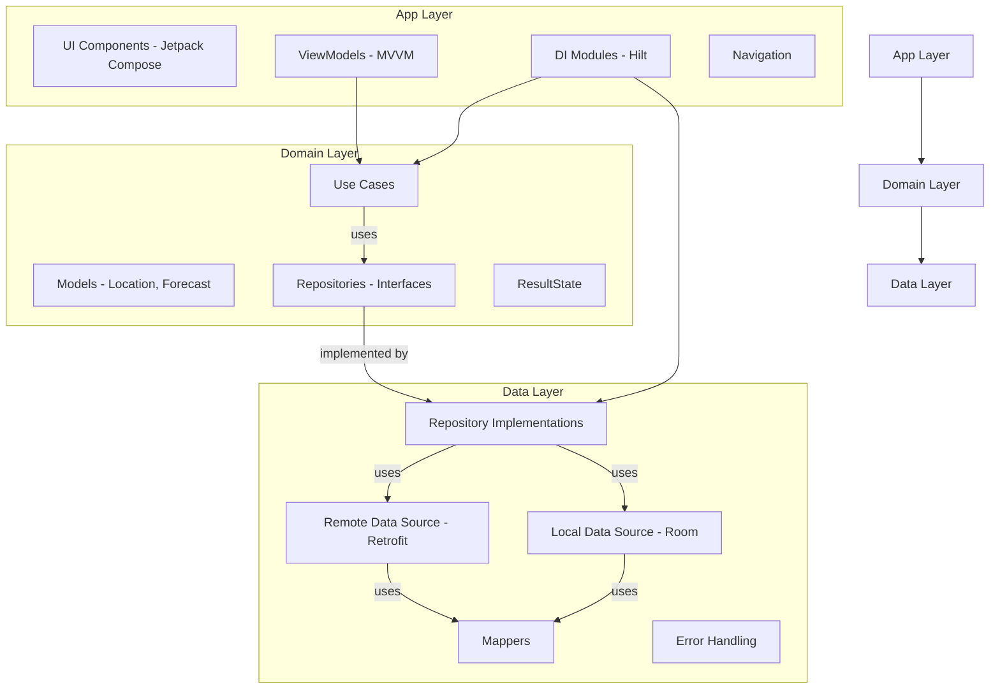

# 📱 Bold Challenge - Weather Forecast App

---
## 🧭 Project Overview

This project is a complete implementation of a **Weather Forecast Android Application** using **Kotlin**, **Jetpack Compose**, and **Clean Architecture** principles.

### 🔍 Key Features

- **Location Search**: Real-time location search with debounced input (500ms delay) to optimize API calls
- **Weather Forecast**: 3-day weather forecast with detailed information per day
- **Cache-First Strategy**: 
  - Immediate display of cached data when available
  - Background refresh from network
  - Seamless offline experience
- **Modern UI**: Material 3 design with smooth animations and responsive layouts
- **State Management**: Explicit state handling with `ResultState` (Loading, Success, Failure)

### 🎯 Key Decisions & Assumptions

- **Clean Architecture**: Strict separation into domain/data/app layers
- **Dual Data Sources**: Online API (WeatherAPI.com) + offline Room database with automatic cache management
- **Cache-First Approach**: Always show cached data immediately, refresh in background
- **MVVM Pattern**: ViewModels per screen for clear separation of concerns
- **Flow-Based**: Reactive data flow using Kotlin Coroutines Flow
- **Offline-First Design**: Room database for local data persistence
- **Debounced Search**: 500ms debounce to reduce unnecessary API calls
- **Error Handling**: Graceful error handling with user-friendly messages and retry functionality

---
## Architecture Approach

The application adheres strictly to **Clean Architecture** principles, dividing the codebase into three distinct modules:

* **Domain Layer**: This module contains the core business logic, including models (e.g., `Location`, `Forecast`, `ForecastDay`), repository interfaces (`LocationRepository`, `ForecastRepository`), use cases (e.g., `SearchLocationsUseCase`, `GetForecastUseCase`), and the `ResultState` sealed class for state management. It is independent of Android-specific frameworks.
* **Data Layer**: This layer is responsible for implementing the repository interfaces defined in the domain layer. It includes remote data sources (Retrofit for API calls to WeatherAPI.com), local data sources (Room Database for caching), mappers for converting DTOs to domain models, and error handling.
* **App Layer**: This is the presentation layer, containing UI components (Jetpack Compose Composables), ViewModels for state management (MVVM pattern), navigation using Navigation Compose, and Hilt DI modules for dependency injection.



---
## 📱 Screens

### 1. Splash Screen
- Simple animated splash screen
- Automatic navigation to Search screen after a short delay
- Pure UI component (no ViewModel needed)

### 2. Search Screen
- **SearchBar**: Real-time location search with debounce (500ms)
- **Results List**: Displays matching locations
- **State Management**:
  - Loading state with optional cached data
  - Empty state when no results found
  - Error state with retry functionality
  - Success state with location list
- **Navigation**: Tap a location to navigate to Forecast Detail

### 3. Forecast Detail Screen
- **Location Name**: Display selected location
- **3-Day Forecast**: Weather information for next 3 days
- **Weather Details**: 
  - Date
  - Average temperature (°C)
  - Condition text
  - Condition icon
- **State Management**:
  - Loading with cached data (if available)
  - Refreshing indicator when updating
  - Error state with retry
  - Success state with forecast data
- **Cache-First**: Shows cached data immediately, refreshes in background

---
## 🔄 Data Flow

### Search Flow
1. User types in search bar
2. ViewModel debounces input (500ms)
3. UseCase validates query (minimum 2 characters)
4. Repository checks cache first
5. Emits `Loading` with cached data (if available)
6. Fetches from API in background
7. Updates cache and emits `Success` with fresh data
8. On error, shows cached data or error message

### Forecast Flow
1. User selects a location
2. ViewModel receives location name from navigation
3. UseCase fetches forecast
4. Repository checks cache first
5. Emits `Loading` with cached forecast (if available)
6. Fetches from API in background
7. Updates cache and emits `Success` with fresh forecast
8. On error, shows cached forecast or error message

---
## 🛠️ Tech Stack

### Core Technologies
- **Kotlin** 2.2.0
- **Jetpack Compose** (Material 3)
- **Android Gradle Plugin** 8.11.1
- **Min SDK** 21
- **Target SDK** 36

### Architecture & Patterns
- **Clean Architecture** (Domain, Data, App layers)
- **MVVM** (Model-View-ViewModel)
- **Repository Pattern**
- **Use Cases** (Business Logic)

### Libraries
- **Dependency Injection**: Hilt 2.57.2
- **Networking**: Retrofit 3.0.0, OkHttp 4.12.0
- **JSON Serialization**: Moshi 1.15.0
- **Database**: Room 2.7.1
- **Coroutines**: Kotlinx Coroutines 1.10.2
- **Navigation**: Navigation Compose
- **Image Loading**: Coil 2.7.0
- **Testing**: JUnit 5, MockK, Turbine, Espresso

---
## ✅ Testing Strategy

### Test Types

- **Unit Tests** for use cases, ViewModels, repositories, data sources, and mappers
- **Instrumented UI Tests** for key user flows
- **Flow Testing** using Turbine for reactive streams

### Test Framework

- **JUnit 5** (Modern testing framework)
- **MockK** for mocking dependencies
- **Turbine** for Flow testing
- **Espresso** for UI testing
- **Hilt Testing** for dependency injection in tests

### Test Coverage

Tests are organized by layer:
- `domain/test`: Use case tests
- `data/test`: Repository and data source tests
- `app/test`: ViewModel tests
- `app/androidTest`: UI and integration tests

---
## 🔐 How to Run

### Prerequisites

- Android Studio Hedgehog or later
- JDK 17 or later
- Android SDK with API level 21+
- WeatherAPI.com API key

### Setup Steps

1. **Clone the repository**
   ```bash
   git clone <repository-url>
   cd boldchallenge
   ```

2. **Configure API Key**
   - Create or edit `local.properties` in the root directory
   - Add your WeatherAPI.com API key:
     ```properties
     WEATHER_API_KEY=your_api_key_here
     ```
   - Get your API key from [WeatherAPI.com](https://www.weatherapi.com/)

3. **Build the project**
   ```bash
   ./gradlew assembleDebug
   ```

4. **Run on device/emulator**
   - Open the project in Android Studio
   - Connect a device or start an emulator
   - Click Run or use: `./gradlew installDebug`

### Running Tests

- **Unit Tests**: `./gradlew test`
- **Instrumented Tests**: `./gradlew connectedAndroidTest`
- **All Tests**: `./gradlew check`

---
## 📦 Project Structure

```
boldchallenge/
├── app/                    # Presentation layer
│   ├── src/main/java/com/boldchallenge/
│   │   ├── presentation/
│   │   │   ├── search/     # Search screen
│   │   │   ├── forecast/   # Forecast screen
│   │   │   ├── splash/     # Splash screen
│   │   │   └── navigation/ # Navigation setup
│   │   ├── ui/             # UI components & theme
│   │   └── di/             # Dependency injection
│   └── src/test/           # Unit tests
│   └── src/androidTest/    # Instrumented tests
├── domain/                 # Domain layer
│   ├── src/main/java/com/domain/
│   │   ├── model/          # Domain models
│   │   ├── repository/     # Repository interfaces
│   │   ├── usecase/        # Use cases
│   │   ├── result/         # ResultState
│   │   └── error/          # Error handling
│   └── src/test/           # Domain tests
├── data/                   # Data layer
│   ├── src/main/java/com/data/
│   │   ├── api/            # Retrofit API interface
│   │   ├── db/             # Room database
│   │   ├── dto/            # Data transfer objects
│   │   ├── mapper/        # DTO to Domain mappers
│   │   ├── repository/    # Repository implementations
│   │   ├── error/         # Error mapping
│   │   └── di/            # Data layer DI
│   └── src/test/          # Data layer tests
└── gradle/                 # Gradle configuration
```

---
## 🎨 UI/UX Features

- **Material 3 Design**: Modern Material Design 3 components
- **Smooth Animations**: Animated weather icons and transitions
- **Responsive Layout**: Adapts to different screen sizes
- **Loading States**: Clear loading indicators with optional cached data
- **Error Handling**: User-friendly error messages with retry options
- **Empty States**: Helpful messages when no data is available
- **Glass Morphism**: Modern glassmorphic card designs
- **Gradient Backgrounds**: Beautiful gradient backgrounds

---
## 🔧 Configuration

### API Configuration

The app uses WeatherAPI.com for weather data. Configure your API key in `local.properties`:

```properties
WEATHER_API_KEY=your_api_key_here
```

### Build Configuration

- **Application ID**: `com.boldchallenge`
- **Version Code**: 1
- **Version Name**: 1.0
- **Min SDK**: 21 (Android 5.0)
- **Target SDK**: 36
- **Compile SDK**: 36

---
## 📝 Code Quality

- **Kotlin Lint**: Code formatting with ktlint
- **Clean Code**: Following Android best practices
- **Documentation**: KDoc comments for public APIs
- **Type Safety**: Leveraging Kotlin's type system

---
## 🚀 Future Enhancements

Potential improvements for future versions:
- Add more forecast days (7-day, 14-day)
- Weather alerts and notifications
- Location favorites
- Weather maps
- Historical weather data
- Multiple location support
- Widget support
- Dark/Light theme toggle

---
## 📄 License

This project is part of a coding challenge and is for demonstration purposes.

---
## 👤 Author

Developed as part of the Bold Challenge Android development assessment.

